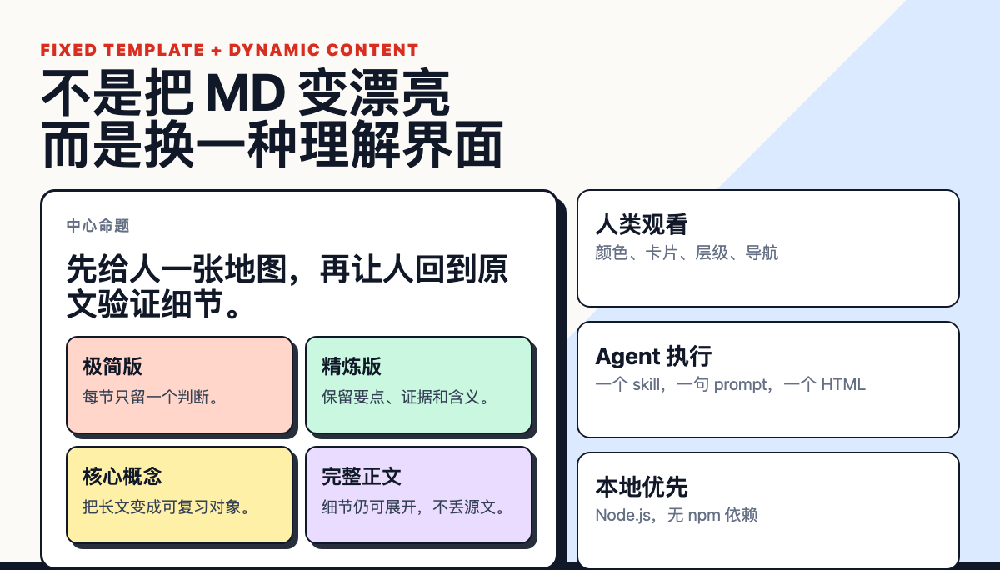
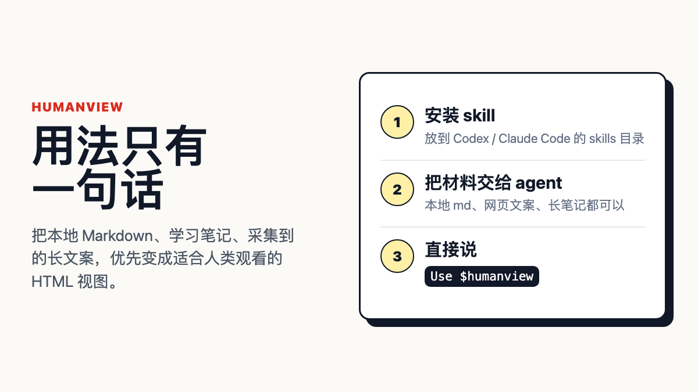
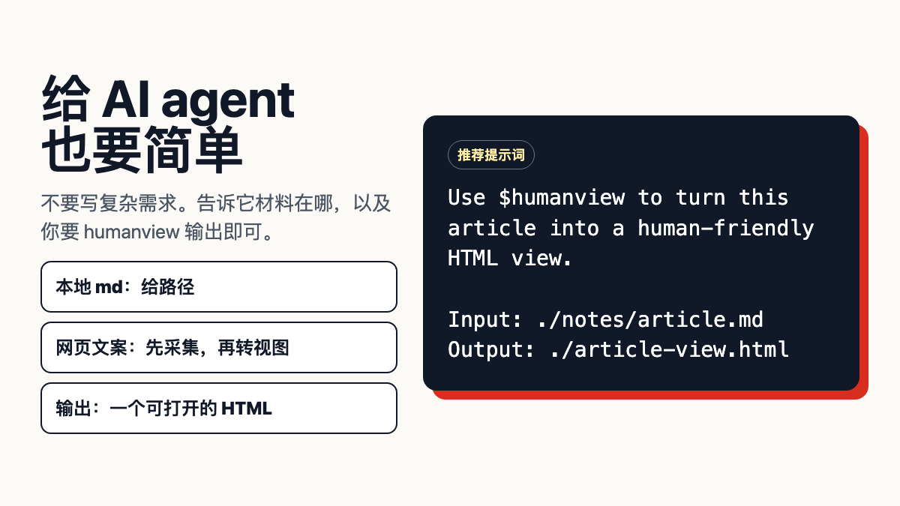

# humanview：把长 Markdown 变成适合人类观看的视图

这个 skill 的开端，来自 Claude Code 团队相关工作人员 Thariq Shihipar 引发的一轮讨论：

> 当 agent 的输出是给人看的时候，HTML 往往比一大段 Markdown 更有效。

这句话真正提醒我的不是“以后不要用 Markdown”。

而是：

**Markdown 适合保存和编辑，HTML 适合呈现和理解。**


所以 humanview 做的事情很简单：

不是把 Markdown 换个皮肤。

而是把本地的 md、学习笔记、采集到的长文案，优先转换成一个适合人类观看的 HTML 视图。

你仍然可以保留原文。

但默认打开时，先看到的是：

- 中心命题
- 极简版卡片
- 精炼版卡片
- 核心概念
- 可选理解问题
- 可展开的完整正文



## 我们的解题思路

长 Markdown 最大的问题，不是它“不好”。

而是它经常把所有信息都压成一条线。

人真正理解一篇新内容，通常不是从第一段读到最后一段。

而是先问：

1. 这篇东西到底在说什么？
2. 哪几个概念最重要？
3. 我该先看哪里？
4. 如果我想验证细节，原文在哪里？

所以 humanview 的结构是固定的：

```text
Markdown / 长文案
        ↓
文章结构
        ↓
学习内容模型
        ↓
固定 HTML 视图
```

换句话说：

**内容可以变，但视图保持稳定。**

这就是 humanview 和普通 Markdown 转 HTML 的区别。

普通转换器关注“格式转换”。

humanview 关注“人能不能更快理解”。

## 最简单的安装方式

把项目拉下来：

```bash
git clone https://github.com/Yinmu/humanview.git
```

把 skill 放进 Codex 或 Claude Code 的 skills 目录：

```bash
mkdir -p ~/.codex/skills
cp -R humanview/humanview ~/.codex/skills/humanview
```

如果你的环境是 Claude Code，也放到它对应的 skills 目录即可。

然后重启你的 agent 工具。

## 人怎么用

你只需要一句话：

```text
Use $humanview to turn this long Markdown article into a human-friendly HTML view.
```

如果你有本地文件，就这样说：

```text
Use $humanview to turn ./notes/article.md into ./article-view.html.
```

如果你是采集到的一段文案，就直接粘贴给 agent：

```text
Use $humanview to turn the following text into a human-friendly HTML view.

[粘贴你的长文案]
```



## 交给 AI agent 怎么用

你可以把下面这段直接丢给 Codex / Claude Code：

```text
Use $humanview to turn this article into a human-friendly HTML view.

Input: ./notes/article.md
Output: ./article-view.html
```

如果材料来自网页，可以这样说：

```text
Please collect the article content from this URL first, then use $humanview to create a human-friendly HTML view.

URL: [你的链接]
Output: ./article-view.html
```



## 这个 skill 适合什么场景

适合：

- 学习一篇长文章
- 复盘一份长笔记
- 把采集到的文案变成可读视图
- 把报告、访谈、教程变成结构化学习页
- 让 agent 的输出不再只是长 Markdown

不适合：

- 只写几行短回复
- 需要多人协作编辑源文档
- 需要严格论文排版
- 需要长期维护的正式网站

## 记住一句话

humanview 不是要消灭 Markdown。

它的定位是：

**Markdown 做源文件，HTML 做人类视图。**

当内容很短，Markdown 足够。

当内容很长，或者你希望别人真的看懂，就让 agent 用 humanview 输出一个 HTML。

这就是它的全部用法。

参考：

- Thariq Shihipar / Claude Code 相关讨论：The Unreasonable Effectiveness of HTML
- Simon Willison 的整理：[Using Claude Code: The Unreasonable Effectiveness of HTML](https://simonwillison.net/2026/May/8/)
- 同类 skill 参考：[html-artifacts](https://github.com/dogum/html-artifacts)
